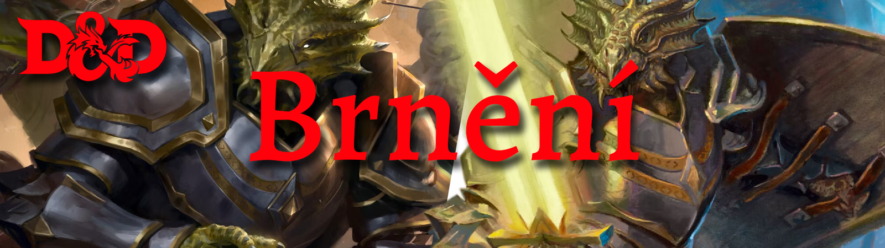

# Brnění
Fantasy herní světy jsou obrovskou tapisérií tvořenou mnoha různými kulturami, z nichž každá má svou vlastní technologickou úroveň. Z tohoto důvodu mají dobrodruzi přístup k různým typům brnění, od kožené zbroje přes drátěnou zbroj až po drahé plátové brnění, s několika dalšími druhy brnění mezi nimi. Tabulka Armor shromažďuje nejběžněji dostupné typy brnění ve hře a rozděluje je do tří kategorií: **lehké brnění, střední brnění a těžké brnění**. Mnoho válečníků doplňuje své brnění štítem.

1. [Zdatnost brnění](#zdatnost brnění)
2. [Třída brnění](#třída brnění)
3. [Lehké brnění](#lehké brnění)
    1. [Polstrované](#polstrované)
    2. [Kůže](#kůže)
    3. [Kůže s cvočky](#kůže s cvočky)
4. [Střední brnění](#střední brnění)
    1. [Kožešinové](#kožešinové)
    2. [Řetížkové triko](#řetízkové triko)
    3. [Kovové šupiny](#kovové šupiny)
    4. [Hrudní plát](#hrudní plát)
    5. [Poloviční plát](#poloviční plát)
5. [Těžké brnění](#těžké brnění)
    1. [Neviditelnost](#neviditelnost)
    2. [Kroužková zbroj](#kroužková zbroj)
    3. [Řetězová košile](#řetězová košile)
    4. [Dlaha](#dlaha)
    5. [Deska](#deska)
6. [Štíty](#štíty)
7. [Oblékání a svlékání zbroje](#oblékání a svlékání)

*Tabulka brnění ukazuje cenu, hmotnost a další vlastnosti běžných typů brnění, které se nosí ve fantasy herních světech.*

## Zdatnost brnění 
Kdokoli si může obléknout brnění nebo připevnit štít na paži. Jen ti, kdo jsou zdatní v používání brnění, však vědí, jak je efektivně nosit. Vaše třída vám dává dovednosti s určitými typy brnění. Pokud nosíte brnění, se kterým **nejste dostatečně zdatní**, máte **nevýhodu v jakékoli kontrole schopností,  záchranném hodu nebo hodu na útok , který zahrnuje sílu nebo obratnost, a nemůžete sesílat kouzla**.

## Třída brnění (Obranné číslo = OČ) 
Brnění chrání svého nositele před útoky. Brnění (a štít), které nosíte, určuje vaši základní třídu brnění.

## Lehké brnění 
Lehká zbroj vyrobená z poddajných a tenkých materiálů upřednostňuje **hbité** dobrodruhy, protože nabízí určitou ochranu bez obětování mobility. Pokud nosíte lehké brnění, **přidáte** svůj modifikátor **Obratnosti** k **základnímu číslu svého typu zbroje**, abyste určili svou třídu zbroje.

### Polstrované 
Polstrované brnění se skládá z prošívaných vrstev látky a vatelínu.

### Kůže 
Náprsník a chrániče ramen této zbroje jsou vyrobeny z kůže, která byla vyztužena vyvařením v oleji. Zbytek brnění je vyroben z měkčích a pružnějších materiálů.

### Kůže s cvočky 
Vyrobena z pevné, ale pružné kůže, kůže s cvočky je vyztužena těsně nasazenými nýty nebo hroty.

## Střední brnění 
Střední brnění nabízí větší ochranu než lehké brnění, ale také více zhoršuje pohyb. Pokud nosíte střední brnění, přidáte svůj **modifikátor Obratnost**, **maximálně na +2**, k základnímu číslu z vašeho typu zbroje, abyste určili svou třídu zbroje.

### Kožešinové 
Toto hrubé brnění se skládá z hustých kožešin a kožešin. Běžně ho nosí barbarské kmeny, zlí humanoidi a další lidé, kteří nemají přístup k nástrojům a materiálům potřebným k vytvoření lepšího brnění.

### Řetízkové triko 
Vyrobeno z do sebe zapadajících kovových kroužků, řetízková košile se nosí mezi vrstvami oblečení nebo kůže. Toto brnění nabízí skromnou ochranu horní části těla nositele a umožňuje tlumení zvuku prstenů, které se o sebe třou, vnějšími vrstvami.

### Kovové šupiny 
Toto brnění se skládá z kabátu a legín (a možná i samostatné sukně) z kůže pokryté překrývajícími se kusy kovu, podobně jako šupiny ryby. Součástí obleku jsou rukavice.

### Hrudní plát 
Toto brnění se skládá z připevněného kovového hrudního kusu, který je opatřen pružnou kůží. Přestože nechává nohy a paže relativně nechráněné, poskytuje dobrou ochranu životně důležitým orgánům nositele, přičemž nositele nechává relativně nezatížený.

### Poloviční plát 
Poloviční plát se skládá z tvarovaných kovových plátů, které pokrývají většinu těla nositele. Nezahrnuje ochranu nohou kromě jednoduchých škvarků, které jsou připevněny koženými řemínky.

## Težké brnění 
Těžší brnění narušuje schopnost nositele pohybovat se rychle, nenápadně a volně. Pokud tabulka brnění ukazuje ve sloupci **Síla** pro typ zbroje „Sil 13“ nebo „Sil 15“, brnění **sníží rychlost nositele o 10 stop**, pokud nositel nemá skóre síly rovné nebo vyšší než uvedené skóre.

Ze všech kategorií brnění nabízí těžká zbroj nejlepší ochranu. Tyto brnění pokrývají celé tělo a jsou navrženy tak, aby zastavily širokou škálu útoků. Pouze zdatní válečníci dokážou zvládnout svou váhu a objem.

Těžké brnění vám **nedovolí** přidat **modifikátor Obratnosti do třídy brnění**, ale také vás **nepenalizuje, pokud je váš modifikátor Obratnosti záporný**.

### Neviditelnost 
Pokud se v tabulce brnění ve sloupci **Neviditelnost** zobrazí „**Nevýhoda**“, nositel má **nevýhodu** při kontrolách **Obratnosti (Nenápadnost)**.

### Kroužková zbroj 
Toto brnění je kožené brnění s všitými těžkými kroužky. Prsteny pomáhají posílit brnění proti úderům mečů a seker. Prstencová pošta je podřadná než řetězová pošta a obvykle ji nosí pouze ti, kteří si nemohou dovolit lepší brnění.

### Řetězová košile 
Řetězová košile je vyrobena z do sebe zapadajících kovových kroužků a obsahuje vrstvu prošívané látky, která se nosí pod brněním, aby se zabránilo tření a zmírnila dopad úderů. Součástí obleku jsou rukavice.

### Dlaha 
Tato zbroj je vyrobena z úzkých svislých proužků kovu přinýtovaných k podložce z kůže, která se nosí přes látkové vycpávky. Pružná řetězová mříž chrání klouby.

### Deska 
Deska se skládá z tvarovaných, do sebe zapadajících kovových desek, které pokrývají celé tělo. Talířový oblek obsahuje rukavice, těžké kožené boty, helmu s hledím a silné vrstvy vycpávky pod brněním. Přezky a popruhy rozloží váhu na tělo.

## Štíty 
Štít je vyroben ze dřeva nebo kovu a nosí se v jedné ruce. Používání štítu **zvyšuje vaši třídu brnění o 2**. V jednu chvíli můžete těžit pouze z jednoho štítu.

## Oblékání a svlékání brnění 
Doba potřebná k nasazení nebo sejmutí brnění závisí na kategorii zbroje.

Don : To je doba potřebná k oblékání brnění. Z OČ brnění budete mít prospěch pouze tehdy, pokud budete mít plný čas na oblékání brnění.

Doff : Toto je čas, který trvá sundat brnění. Pokud máte pomoc, zkraťte tuto dobu na polovinu.
