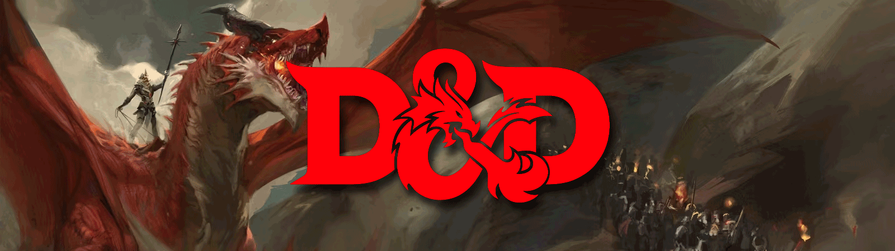

# Jak na DnD
<i>Stránka věnovaná českému popisu a vysvětlení fungování TTRPG hry Dungeons & Dragons</i>

Celá podstata této stránky je pomoci novým hráčům ale i zatvrzelým veteránům ujastnit, objastnit a připomenout podstatné základy DnD, které by se měly uplatňovat ve Vašich hrách.

## Já jsem Feela
Váš průvodce DnD. Sám jsem začátečník ale se zápalem pro tuto nádhernou hru. Zápal ve mě vyvolává potřebu studovat a naučit se tuto hru do detailů, proto bych chtěl dát možnost dalším hráčům a pánům jeskyně poskytnout podporu a vysvětlení, které jsem se naučil.

## Odkazy na obsah
[Souboj](souboj/index.md)

## Co je Dungeons & Dragons
Dungeons & Dragons (zkráceně jako D&D nebo DnD) je fantasy hra na hrdiny (RPG), vydaná společností Wizards of the Coast. Původní Dungeons & Dragons, vytvořené Garym Gygaxem a Davem Arnesonem, bylo poprvé vydáno v roce 1974 Gygaxovou firmou Tactical Studies Rules (TSR).

Hráči D&D si vytvářejí fiktivní postavy, které se vydávají na imaginární dobrodružství ve fantasy světě. Postavy tvoří družinu, která jedná s obyvateli světa (a postavy jednají navzájem). Společně pak bojují s rozličnými druhy fiktivních nestvůr, řeší záhady a problémy, získávají poklady a vědomosti. V průběhu hry získávají postavy zkušenostní body, čímž se v průběhu několika sezení stávají stále mocnějšími. D&D se od tradičních figurkových válečných her odlišuje v tom ohledu, že přiděluje každému hráči ve hře konkrétní postavu, a nikoliv celé legie nebo armády. D&D také přináší koncept Pána jeskyně (v orig. Dungeon Master, zkracováno DM nebo PJ), což je vypravěč a rozhodčí, zodpovědný za tvorbu fiktivního prostředí hry, usměrňování hráčských postav a ztvárnění podpůrných elementů – cizích (nehráčských) postav apod.

Hra se obvykle vyvíjí v průběhu řady setkání hráčů a PJ, v kterémžto případě se nazývá tažením, sezením nebo kampaní. Obvykle hraje hráč jen jednu postavu, byť některé hry umožňují jich ztvárnit najednou i více. Hráči a PJ sledují vývoj činnosti postavy, její charakteristiky a majetky s použitím papíru a tužky, případně jejich elektronického ekvivalentu. Vydaná pravidla hry vysvětlují, jak vytvořit a vybavit postavu, jak fungují její síly a schopnosti, jak probíhají různá jednání a boj a stejně tak i magické předměty a kouzla, pro tento žánr typická. Leč pravidla také vyzývají PJ, aby je upravil tak, aby vyhovovaly jak prostředí, tak i skupině hráčů, s nimiž hraje.
