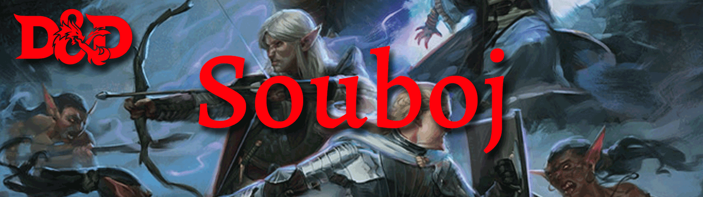

# Souboj
V této části si rozebereme postup a možnosti, když příjde skupina dobrodruhů do <b>boje</b>.

Typickým bojovým střetnutím je střet dvou stran, útoky zbraní, finty, odrážení, rychlé pohyby a sesílání kouzel. Hra organizuje chaos boje do cyklu kol a tahů. <i>Kolo představuje v herním světě asi 6 sekund.</i> Během kola se každý účastník bitvy vystřídá. Pořadí tahů je určeno na začátku bojového střetnutí, kdy každý hodí iniciativu. Jakmile se všichni vystřídají, boj pokračuje dalším kolem, pokud ani jedna strana neporazí druhou.

## Obsah
1. [Postup boje](#postup boje)
2. [Začátek boje: překvapení](#překvapení)
3. [Začátek boje: iniciativa](#iniciativa)
4. [Řada je na tobě](#řada na tobě)
5. [Pohyb](#pohyb)
    1. [Speciální druhy pohybu](#speciální druhy pohybu)
    2. [Obtížný terén](#obtížný terén)
    3. [Nepřítelův prostor](#nepřítelův prostor)
    4. [Náchylný/na lopatkách](#náchylný)
6. [Akce](#akce)
    1. [Útok](#útok)
    2. [Seslání kouzla](#seslání kouzla)
    3. [Sprint](#sprint)
    4. [Odejít z boje](#odejít)
    5. [Vyhnout se](#vyhnout)
    6. [Pomoc](#pomoc)
    7. [Skrýt se](#skrýt)
    8. [Připravit se](#připravit se)
    9. [Hledání](#hledání)
7. [Bonusová akce](#bonusová akce)
8. [Interakce](#interakce)
    1. [Další akce/interakce které můžete během svého tahu dělat](#další akce)
9. [Reakce](#reakce)
10. [Provedení útoku](#provedení útoku)
11. [Hod na útok](#attack roll)
    1. [Modifikátory hodu](#modifikátor hodu)
    2. [Útok na skryté nepřátele](#útok na skryté nepřátele)
    3. [Útoky na dálku](#útoky na dálku)
    4. [Útok na dálku v blízké vzdálenosti](#útok na dálku v blízké vzdálenosti)
    5. [Útok na blízko](#útok na blízko)
    6. [Příležitostný útok](#příležitostný útok)
    7. [Boj s dvěma zbraněmi](#boj s dvěma zbraněmi)
    8. [Popadnout](#popadnout)
    9. [Strčit](#strčit)
    10. [Krytí](#krytí)
12. [Poškození a léčení](#poškození a léčení)
13. [Hod na poškození](#damage roll)
    1. [Typy poškození](#typy poškození)
    2. [Odolnost proti poškození a zranitelnost](#odolnost a zranitelnost)
14. [Kritický zásah](#kritický zásah)
15. [Léčení](#léčení)
    1. [Snížení na 0 životů](#0 životů)
    2. [Dočasné životy](#dočasné životy)

## Postup boje 
<i>(Pro Pána jeskyně/DM)</i> <b>Určete překvapení.</b> DM určí, zda je někdo zapojený do bojového střetnutí překvapen.

<i>(Pro Pána jeskyně/DM)</i> <b>Stanovit pozice:</b> DM rozhodne, kde se nacházejí všechny postavy a monstra. Vzhledem k pochodovému rozkazu dobrodruhů nebo jejich uvedeným pozicím v místnosti.

<b>Iniciativa hodu:</b> Každý, kdo se účastní bojového střetnutí, hází iniciativu, určující pořadí tahů bojovníků.
Střídejte se. Každý účastník bitvy se střídá v pořadí iniciativy. <i>(Při každém začátku nového boje hráči házi iniciativu znovu, pokud DM nerozhodne jinak, např. že si hráči určí iniciativu na zbytek dané hry/zasedání)</i>

<b>Začněte další kolo:</b> Když se všichni zúčastnění v boji dostali na řadu, kolo končí. Opakujte, dokud boj neustane.

## Začátek boje: překvapení 
DM určí, kdo by mohl být překvapen. Pokud se ani jedna strana nesnaží být kradmá/tajná, automaticky si všimnou jeden druhého. Jinak DM porovnává kontroly Obratnosti (Nenápadnost) kohokoli, kdo se skrývá, s pasivním skóre moudrosti (Vnímání) každé bytosti na protější straně. Jakákoli postava nebo monstrum, které si nevšimne hrozby, je na začátku střetnutí překvapeno.

Pokud jste překvapeni, nemůžete se hnout nebo provést akci ve svém prvním tahu v boji a nemůžete reagovat, dokud toto kolo neskončí. Člen skupiny může být překvapen, i když ostatní členové nejsou.

**Příklad**

<i>Skupina dobrodruhů se vplíží do tábora banditů , vyskočí ze stromů a napadne je. Želatinová kostka klouže chodbou v kobce, aniž by si ji dobrodruzi všimli, dokud kostka jednoho z nich nepohltí.</i> 

## Začátek boje: Iniciativa 
<b>Iniciativa určuje pořadí tahů během boje.</b> Když začne boj, každý účastník provede <b>kontrolu Obratnosti</b>, aby určil své místo v pořadí iniciativy. DM hodí jeden hod pro celou skupinu identických tvorů/bestií/nepřátel, takže každý člen skupiny protivníků jedná ve stejnou dobu.

DM seřadí bojovníky v pořadí od jednoho s nejvyšším součtem kontroly obratnosti po toho s nejnižším (nejvyšší číslo jde jako první, nejnižší jako poslední). Toto je pořadí (nazývané iniciativní pořadí), ve kterém jednají během každého kola. Pořadí iniciativy zůstává kolo od kola daného souboje stejné.

Pokud dojde k remíze, DM rozhodne o pořadí mezi tvory ovládanými DM a hráči rozhodnou o pořadí mezi svými shodnými postavami. DM může rozhodnout o pořadí, pokud je remíza mezi monstrem a hráčskou postavou. Volitelně může DM nechat postavy a nestvůry, aby každá hodila d20 k určení pořadí, přičemž nejvyšší hod bude první.

## Řada je na tobě 

Ve svém tahu se můžete <b>pohybovat</b> podle tvé rychlosti a provést nějakou z akcí: <b>akci, bonusovou akci, interakci, reakci.</b>

Vy se rozhodnete, zda se pohnete jako první, nebo jako první podniknete akci. Vaše rychlost – někdy nazývaná jako rychlost chůze – je uvedena na kartě postavy.
Mnoho funkcí třídy a dalších schopností poskytuje další možnosti pro vaši akci.

Ve svém tahu se můžete vzdát pohybu, akce nebo čehokoli jiného. Pokud se nemůžete rozhodnout, co ve svém tahu dělat, zvažte provedení akce <b>Vyhýbání</b> nebo <b>Připravit se</b>.

## Pohyb 
V boji jsou postavy a monstra v neustálém pohybu a často využívají pohyb a pozici k získání převahy.

Ve vašem tahu se můžete posunout o vzdálenost své rychlosti. Ve svém tahu můžete použít tolik nebo jen málo své rychlosti, jak chcete, podle zde uvedených pravidel.

Ve svém tahu můžete svůj pohyb přerušit použitím určité rychlosti před a po akci. Například, pokud máte rychlost 30 stop, můžete se posunout o 10 stop, provést akci a pak se posunout o 20 stop.

### Speciální druhy pohybu 
Váš pohyb může zahrnovat skákání, lezení a plavání. Tyto různé způsoby pohybu lze kombinovat s chůzí nebo mohou představovat celý váš pohyb. Ať se pohybujete jakkoli, odečtete vzdálenost každé části vašeho pohybu od vaší rychlosti, dokud se nespotřebuje nebo dokud se nedokončíte.

### Obtížný terén 
Boj se zřídka odehrává v holých místnostech nebo na nevýrazných pláních. Balvany – poseté jeskyně, vřes – udusané lesy, zrádná schodiště – prostředí typického boje obsahuje obtížný terén.

Každá stopa pohybu v těžkém terénu stojí 1 stopu navíc. Toto pravidlo platí, i když se více věcí v prostoru počítá jako obtížný terén.

Nízký nábytek, suť, podrost, strmé schody, sníh a mělké bažiny jsou příklady obtížného terénu. Prostor jiného tvora, ať už nepřátelského nebo ne, se také počítá jako obtížný terén.

### Nepřítelův prostor 
Můžete se pohybovat prostorem nepřátelského tvora. Naproti tomu se můžete pohybovat prostorem nepřátelského tvora, pouze pokud je tvor alespoň o dvě velikosti větší nebo menší než vy. Pamatujte, že prostor jiného tvora je pro vás **obtížný terén.**

Ať už je tvor přítel nebo nepřítel, nemůžete svůj pohyb v jeho prostoru **dobrovolně ukončit.**

Pokud během svého pohybu opustíte dosah nepřátelské bytosti, vyvoláte **příležitostný útok**, pro bezpečné opuštění prostoru musíte použít **odejít z boje**.

### Náchylný/na lopatkách 
Bojovníci se můžou ocitnout ležet na zemi, buď proto, že jsou sraženi, nebo proto, že se sami vrhnou dolů. Ve hře jsou **složeni na zemi**.

Můžete klesnout na sklonku, aniž byste použili jakoukoli svou rychlost. Vstát vyžaduje více úsilí; to stojí pohyb rovnající se polovině vaší rychlosti.
Například, pokud je vaše rychlost 30 stop, musíte strávit 15 stop pohybu, abyste se postavili. Nemůžete vstát, pokud nemáte dostatek pohybu nebo pokud je vaše rychlost 0.

Abyste se mohli pohybovat na břiše, musíte se plazit nebo používat magii, jako je teleportace. Každá stopa pohybu při plazení stojí 1 stopu navíc. Plazení 1 stopa v těžkém terénu, tedy stojí 3 stopy pohybu.

## Akce 
Když ve svém tahu provedete akci, můžete provést jednu ze zde uvedených akcí: akci útoku, kterou zaútočíte na nepřítele, akci, kterou jste získali ze své třídy nebo speciální funkce, nebo akci, kterou improvizujete. Mnoho nestvůr má ve svých statistických blocích vlastní možnosti akcí.

Když popíšete akci, která není podrobně popsána jinde v pravidlech, DM vám řekne, zda je tato akce možná a jaký druh hodu musíte provést, pokud vůbec nějaký, abyste určili úspěch nebo neúspěch.

### Útok 
Nejběžnější akcí v boji je akce **Útok**, ať už mácháte mečem, střílíte šíp z luku nebo se rvete pěstmi.
Touto akcí provedete jeden útok na blízko nebo na dálku. Pravidla, kterými se útoky řídí, najdete v části <b>„Provedení útoku“.</b>

Některé funkce, jako je například funkce **Útok navíc** u **Bojovníka**, vám umožňují provést více než jeden útok pomocí této akce.

### Seslání kouzla 
Sesilatelé kouzel, jako jsou čarodějové a klerikové, stejně jako mnoho nestvůr, mají přístup ke **kouzlům** a mohou je použít s velkým efektem v boji. Každé kouzlo má dobu sesílání , která určuje, zda sesilatel musí k seslání kouzla použít akci, reakci, minuty nebo dokonce hodiny. Seslání kouzla proto není nutně akce. Většina kouzel má čas seslání 1 akce, takže sesilatel často používá svou akci v boji k seslání takového kouzla.

### Sprint 
Když provedete akci **Sprint**, získáte další pohyb pro aktuální tah. Zvýšení se rovná vaší rychlosti po použití jakýchkoli modifikátorů. Například s rychlostí 30 stop se můžete ve svém tahu posunout až o 60 stop, pokud utečete.
Jakékoli zvýšení nebo snížení vaší rychlosti změní tento dodatečný pohyb o stejnou hodnotu. Pokud je vaše rychlost z 30 stop snížena například na 15 stop, můžete se v této zatáčce posunout až o 30 stop, pokud budete uhánět.

### Odejít z boje 
Pokud provedete akci **Odejít z boje**, váš pohyb nevyvolá **příležitostné útoky** po zbytek tahu.

### Vyhnout se 
Když podniknete akci **Vyhnout se**, soustředíte se výhradně na vyhýbání se útokům . Do začátku vašeho příštího tahu má jakýkoli hod na útok proti vám nevýhodu, pokud útočníka vidíte, a vy děláte záchranné hody Obratnost s výhodou. Tuto výhodu ztrácíte, pokud jste nezpůsobilí (například kvůli množství a váze vašeho brnění) nebo pokud vaše rychlost klesne na 0.

### Pomoc 
Při splnění úkolu můžete svou **pomoc** půjčit jinému tvorovi. Když provedete akci Help, bytost, které pomáháte, získá výhodu při další kontrole schopností, kterou provede, aby mohla provést úkol, se kterým pomáháte, za předpokladu, že kontrolu provede před začátkem vašeho příštího kola.

Případně můžete pomoci přátelskému tvorovi zaútočit na tvora do 5 stop od vás. Předstíráte, odlákáte pozornost cíle nebo se nějakým jiným způsobem spojíte, aby byl útok vašeho spojence efektivnější. Pokud váš spojenec zaútočí na cíl před vaším dalším tahem, první hod na útok je proveden s výhodou .

### Skrýt se 
Když provedete akci Skrýt, provedete kontrolu Obratnosti (Nenápadnost) ve snaze skrýt se podle pravidel pro skrývání. Pokud uspějete, získáte určité výhody.

### Připravit se 
Někdy chcete skočit na nepřítele nebo počkat na konkrétní okolnost, než začnete jednat. Chcete-li to provést, můžete ve svém tahu provést akci **Připraven**, která vám umožní jednat pomocí reakce před začátkem dalšího tahu.

Nejprve se rozhodnete, jaká vnímatelná okolnost vyvolá vaši reakci. Poté si vyberete akci, kterou provedete v reakci na tento spouštěč, nebo se v reakci na něj rozhodnete zvýšit svou rychlost . Příklady zahrnují: „Pokud kultista šlápne na padací dveře, zatáhnu za páku, která je otevře,“ a „Pokud skřet stoupne vedle mě, vzdálím se.“

Když nastane spouštěč, můžete buď reagovat hned poté, co spoušť skončí, nebo spouštěč ignorovat. Pamatujte, že za kolo můžete provést pouze jednu reakci. Když kouzlo připravíte, sešlete ho jako obvykle, ale podržíte jeho energii, kterou uvolníte svou reakcí, když nastane spouštěč.

Aby bylo kouzlo připraveno, musí mít čas seslání 1 akce a udržení magie kouzla vyžaduje soustředění . Pokud je vaše soustředění narušeno, kouzlo se rozplyne, aniž by nabylo účinku. Pokud se například soustředíte na kouzlo a připravenou magickou střelu, vaše kouzlo skončí, a pokud utrpíte poškození před vypuštěním magické střely s vaší reakcí může být vaše koncentrace narušena.

### Hledání 
Když provedete akci **Hledat**, věnujete svou pozornost hledání něčeho. V závislosti na povaze vašeho hledání vás DM může nechat provést kontrolu moudrosti (vnímání) nebo kontrolu inteligence (pátrání).

## Bonusová akce 
Různé funkce třídy, kouzla a další schopnosti vám umožňují ve vašem tahu provést další akci, která se nazývá bonusová akce. Funkce **Mazaná** akce například umožňuje třídě **tulák** provést bonusovou akci. 

Bonusovou akci můžete provést pouze tehdy, když **speciální schopnost, kouzlo nebo jiná vlastnost** hry uvádí, že můžete něco udělat jako bonusovou akci. Jinak nemáte žádnou bonusovou akci, kterou byste mohli provést.

Ve svém tahu můžete provést pouze jednu bonusovou akci, takže si musíte vybrat, kterou bonusovou akci použijete, když jich máte k dispozici více.
Sami si zvolíte, kdy během svého tahu provedete bonusovou akci, pokud není určeno načasování bonusové akce a cokoli, co vás připraví o vaši schopnost provádět akce, vám také zabrání v provedení bonusové akce.

## Interakce 
Normálně interagujete s předmětem, když děláte něco jiného, například když v rámci útoku tasíte meč. Když objekt ke svému použití vyžaduje vaši akci, provedete akci **Použít objekt**. Tato akce je také užitečná, když chcete ve svém tahu komunikovat s více než jedním objektem.

### Další akce/interakce které můžete během svého tahu dělat 
Váš tah může zahrnovat různé činnosti, které nevyžadují ani vaši akci, ani váš pohyb.

Jak budete na řadě, můžete komunikovat, jak jen dokážete, prostřednictvím krátkých promluv a gest.

Můžete také bezplatně interagovat s jedním objektem nebo funkcí prostředí, ať už během vašeho pohybu nebo vaší akce. Můžete například otevřít dveře během svého pohybu, když kráčíte k nepříteli, nebo můžete **tasit zbraň v rámci stejné akce, kterou používáte k útoku.**

Pokud chcete interagovat s druhým objektem, nebo tasit druhou zbraň, musíte použít svou **akci.** Některé magické předměty a jiné speciální předměty vždy vyžadují k použití akci, jak je uvedeno v jejich popisu.

DM může vyžadovat, abyste použili akci pro kteroukoli z těchto činností, když to vyžaduje zvláštní požadavky nebo když představuje neobvyklou překážku. *Například DM mohl rozumně očekávat, že použijete akci k otevření zaseknutých dveří nebo otočení kliky ke spuštění padacího mostu.*

Další příklady interakcí, které můžete dělat během svého tahu bez použití akce:
- tasit nebo zasouvat meč do pochvy
- otevřít nebo zavřít dveře
- vytáhni lektvar z batohu
- sebrat upuštěnou sekeru
- vzít cetku ze stolu
- sundejte si prsten z prstu
- nacpat si do úst nějaké jídlo
- zasadit transparent do země
- vylovte pár mincí z kapsy na opasku
- vypijte všechno pivo v láhvi
- zatáhnout pákou nebo vypínačem
- vytáhnout pochodeň ze svícnu
- vezměte knihu z police, na kterou dosáhnete
- uhasit malý plamen
- nasadit masku
- přetáhněte si kapuci svého pláště a přes hlavu
- přilož ucho ke dveřím
- kopnout do malého kamene
- otočit klíčem v zámku
- poklepejte na podlahu 10stopou tyčí
- předat předmět jiné postavě

A další...

## Reakce 
Některé speciální schopnosti, kouzla a situace vám umožňují provést speciální akci zvanou reakce. Reakce je okamžitá reakce na nějaký druh spouštění, ke kterému může dojít ve vašem tahu nebo na tahu někoho jiného. **Příležitostný útok** je nejběžnějším typem reakce.

Reakce funguje na principu reagování na dění. Například pokud nepřítel opustí tvůj prostor souboje bez použití **Odejít z boje**, můžeš ho potrestat **příležitostným útokem**.

Když zareagujete, nemůžete do začátku dalšího tahu přijmout další. Pokud reakce přeruší tah jiné bytosti, může tato bytost pokračovat ve svém tahu hned po reakci.

## Provedení útoku 
Když už chápeme základní schopnosti a pravidla boje, přichází čas na samotnou akci, na samotný **útok**.

Ať už útočíte zbraní na blízko, střílíte ze zbraně na dálku nebo provádíte hod na útok jako součást kouzla, útok má jednoduchou strukturu.

**Vyberte si cíl**. Vyberte si cíl v dosahu vašeho útoku: bytost, předmět nebo místo.

**Určete modifikátory**. DM určuje, zda má cíl krytí a zda máte proti cíli výhodu nebo nevýhodu. Kromě toho mohou kouzla, speciální schopnosti a další efekty uplatňovat postihy nebo bonusy k vašemu hodu na útok.

**Vyřešte útok**. Provedete **hod na útok**. Při zásahu, **házíte zranění**, pokud konkrétní útok nemá pravidla, která určují jinak. Některé útoky způsobují kromě poškození nebo místo něj i speciální efekty.

Pokud se někdy objeví nějaká otázka, zda se něco, co děláte, počítá jako útok, pravidlo je jednoduché: pokud provádíte hod na útok, provádíte útok.

## Hod na útok 
**Když provedete útok, váš hod na útok určuje, zda útok zasáhne nebo mine**. 

Chcete-li provést hod na útok, hoďte k20 a přidejte příslušné modifikátory. Pokud se součet hodů plus modifikátorů rovná nebo překračuje obranné číslo cíle (OČ), útok zasáhne. OČ postavy se určuje při vytváření postavy, zatímco OČ nestvůry je v jejím bloku statistik.

### Modifikátory hodu 
Když postava hodí na útok, dva nejběžnější modifikátory hodu jsou modifikátor schopností a bonus za odbornost/zdatnost postavy. Když nestvůra hodí na útok, použije jakýkoli modifikátor, který má v bloku statistik.

**Modifikátor schopnosti**: Modifikátor schopnosti používaný pro **útok zbraní na blízko** je **Síla** a modifikátor schopnosti používaný pro útok **zbraní na dálku** je **Obratnost**. Zbraně, které mají fines (šikovné) nebo házenou vlastnost, toto pravidlo porušují (šikovné zbraně mohou používat buď sílu nebo obratnost). Některá kouzla také vyžadují hod na útok. Modifikátor schopnosti použitý pro útok kouzla závisí na schopnosti sesílat zaklínadla dané postavy a třídy. (u bardů je to Charisma, u Druidů je to Moudrost, atd.)

**Bonus za odbornost/zdatnost**: K hodu na útok přidáte bonus za svou odbornost/zdatnost, když útočíte pomocí zbraně, **kterou ovládáte**, a také když **útočíte kouzlem.**

**Hození 1 nebo 20**

Někdy osud požehná nebo prokleje bojovníka, takže nováček zasáhne a veterán mine.

Pokud je hod k20 na útok 20, útok zasáhne **bez ohledu na jakékoli modifikátory nebo OČ cíle**. Tomu se říká **kritický zásah.**

Pokud je hod k20 na útok 1, útok **mine bez ohledu na jakékoli modifikátory nebo OČ cíle.**

### Útok na skryté nepřátele 
Bojovníci se často snaží uniknout pozornosti svých nepřátel tím, že se schovávají, sesílají kouzla neviditelnosti nebo číhají ve tmě.

Když zaútočíte na cíl, který nevidíte, máte **nevýhodu v hodu na útok**. To platí, ať už tipujete polohu cíle nebo míříte na tvora, kterého slyšíte, ale nevidíte. Pokud cíl není v lokaci, na kterou jste cílili, automaticky minete, ale DM obvykle jen řekne, že útok minul, nikoli to, zda jste správně uhodli polohu cíle.

Když tě bytost nevidí, máš výhodu v hodech na útok proti ní. Pokud jste skryti – neviditelní i neslyšení – když provádíte útok, **prozradíte svou polohu, když útok zasáhne nebo mine.**

### Útoky na dálku 
Útoky na dálku můžete provádět pouze proti cílům v určeném rozsahu.
Pokud má útok na dálku, jako je například kouzlo, jeden daný dosah, nemůžete zaútočit na cíl mimo tento rozsah.

Některé útoky na dálku, jako jsou ty prováděné dlouhým nebo krátkým lukem, mají dva dosahy. Menší číslo je normální dosah a větší číslo je dlouhý dosah. Váš hod na útok má nevýhodu, když je váš cíl mimo normální dostřel a nemůžete zaútočit na cíl mimo velkou vzdálenost.

### Útok na dálku v blízké vzdálenosti 
Zamířit útok na dálku je obtížnější, když je vedle vás nepřítel. Když provedete útok na dálku se zbraní, kouzlem nebo nějakým jiným způsobem, máte nevýhodu v hodu na útok, pokud jste do 5 stop od nepřátelského tvora, který vás vidí a který není nezpůsobilý nebo omráčený.

### Útoky na blízko 
Útok na blízko vám umožňuje zaútočit na nepřítele ve vašem dosahu. Útok na blízko obvykle používá ruční zbraň, jako je meč, válečné kladivo nebo sekera. 

Typické monstrum provede útok zblízka, když udeří svými drápy, rohy, zuby, chapadly nebo jinou částí těla. Několik kouzel také zahrnuje provedení útoku na blízko. Většina tvorů má dosah 5 stop a mohou tak při útoku na blízko zaútočit na cíle do 5 stop od nich. Některá stvoření (typicky větší než střední) mají útoky na blízko s dosahem větší než 5 stop, jak je uvedeno v jejich popisech. 

Místo použití zbraně k útoku zbraní na blízko můžete použít **úder beze zbraně**: úder pěstí, kop, úder hlavou nebo podobný silný úder (žádný z nich se nepočítá jako zbraně). Při zásahu způsobí úder beze zbraně **úderné poškození rovné 1 + váš modifikátor.** Jste **zdatní** ve svých neozbrojených úderech.

### Příležitostný útok 
V boji všichni neustále sledují šanci zasáhnout nepřítele, který prchá nebo prochází kolem. Takový úder se nazývá **příležitostný útok.**
Příležitostný útok můžete provést, když se nepřátelský tvor, kterého vidíte, přesune mimo váš dosah (vaše zóna boje - 5 stop). Chcete-li provést příležitostný útok, použijete svou **reakci** k jednomu útoku na blízko proti provokujícímu tvorovi. K útoku dojde těsně předtím, než tvor opustí váš dosah.

Vyvolání příležitostného útoku se můžete vyhnout tím, že **odejdete z boje**. Také nevyvoláte příležitostný útok, když se teleportujete nebo když s vámi někdo nebo něco pohne, aniž byste použili váš pohyb, akci nebo reakci. Například nevyvoláte příležitostný útok, pokud vás výbuch odhodí z dosahu nepřítele nebo pokud gravitace způsobí, že propadnete kolem nepřítele.

### Boj s dvěma zbraněmi 
Když provedete akci Útok a zaútočíte lehkou zbraní na blízko, kterou držíte v jedné ruce, můžete použít **bonusovou akci k útoku jinou lehkou zbraní** na blízko, kterou držíte v **druhé ruce**. K poškození bonusového útoku **nepřidáváte svůj modifikátor schopnosti**, pokud tento modifikátor není záporný.

Pokud má kterákoli zbraň vlastnost hozené, můžete ji hodit, místo abyste s ní zaútočili na blízko.

### Popadnout 
Když chcete chytit stvoření nebo s ním zápasit, můžete pomocí akce Útok provést speciální útok na blízko, **popadnout**. Pokud jste schopni provést více útoků pomocí akce Útok, tento útok nahradí jeden z nich.

Cíl vašeho popadnutí nesmí být o více než jednu velikost větší než vy a musí být ve vašem dosahu. S použitím alespoň jedné volné ruky se pokusíte zmocnit cíle tím, že místo hodu na útok provedete kontrolu popadnutí: **kontrola síly (atletika)** je oponována **kontrolou síly (atletika)** nebo **obratnosti (akrobacie)** cíle (cíl volí schopnost). Pokud uspějete, vystavíte cíl uvíznutému stavu (nemůže se samovolně hýbat a útočit, dokud se nevymaní). Podmínka určuje věci, které ji ukončují, a cíl můžete uvolnit, kdykoli budete chtít (nevyžaduje se žádná akce).

**Vymanit se popadnutí**: Uchvácená bytost může použít svou akci k útěku. Chcete-li tak učinit, musí uspět v **kontrole síly (atletika)** nebo **obratnosti (akrobacie)**, která je oponována kontrolou vaší **síly (atletika)**.

**Pohyb popadnutého tvora**: Když se pohybujete, můžete uchopeného tvora táhnout nebo nést s sebou, ale vaše rychlost je poloviční, pokud tvor není o dvě nebo více velikostí menší než vy.

### Strčit 
Pomocí akce Útok můžete provést speciální útok na blízko a **strčit do tvora, buď ho srazit na zem, nebo odstrčit od sebe**. Pokud jste schopni provést více útoků pomocí akce Útok, tento útok nahradí jeden z nich.

Cíl nesmí být o více než jednu velikost větší než vy a musí být ve vašem dosahu. Namísto hodu na útok provedete kontrolu **síly (atletika)**, která je oponována kontrolou **síly (atletika) nebo obratnosti (akrobacie)** (cíl si zvolí schopnost). Pokud vyhrajete soutěž, buď srazíte cíl na zem, nebo jej odtlačíte 5 stop od sebe.

### Krytí 
Zdi, stromy, stvoření a další překážky mohou poskytnout **úkryt během boje**, takže je obtížnější ublížit cíli. Cíl může mít prospěch z krytí pouze tehdy, když útok nebo jiný efekt pochází z opačné strany krytí.
Existují tři stupně krytí. Pokud je cíl za více zdrojích krytí, platí pouze **nejochrannější stupeň krytí**; stupně se **nesčítají**. *Pokud je například cíl za bytostí, která poskytuje poloviční kryt, a kmenem stromu, který poskytuje kryt ze tří čtvrtin, cíl má kryt ze tří čtvrtin.*

**Cil s polovičním krytem** má bonus +2 k záchranným hodům OČ a Obratnosti. Cíl má poloviční krytí, pokud překážka blokuje alespoň polovinu jeho těla. Překážkou může být nízká zeď, velký kus nábytku, úzký kmen stromu nebo stvoření, ať už je to stvoření nepřítel nebo přítel.

**Cíl s tříčtvrtinovým krytím** má bonus +5 k záchranným hodům OČ a Obratnosti. Cíl má pokrytí ze tří čtvrtin, pokud jsou přibližně tři čtvrtiny pokryty překážkou. Překážkou může být padací mříž, štěrbina šípu nebo silný kmen stromu.

**Cíl s úplným krytím** nemůže být zaměřen přímo útokem nebo kouzlem, ačkoli některá kouzla mohou dosáhnout takového cíle tím, že jej zahrnou do oblasti účinku. Cíl má úplné krytí, pokud je zcela zakryt překážkou.

## Poškození a léčení 
Zranění a riziko smrti jsou stálými společníky těch, kteří zkoumají fantasy herní světy. Úder meče, dobře zasažený šíp nebo světlo plamene z kouzla ohnivé koule – to vše má potenciál poškodit nebo dokonce zabít i ty nejodolnější tvory.

Životní body představují kombinaci fyzické a duševní odolnosti, vůle žít a štěstí. Tvory s více životy je těžší zabít. Ti s menším počtem životů jsou křehčí.

Aktuální životy bytosti mohou být jakékoli číslo od maxima života bytosti až po 0. Toto číslo se často mění, když bytost utrpí zranění nebo se uzdraví.

Kdykoli bytost utrpí zranění, toto poškození se odečte od jejích životů. Ztráta životů nemá žádný vliv na schopnosti bytosti, dokud bytost neklesne na 0 životů.

## Hod na poškození 
Každá zbraň, kouzlo a schopnost škodlivého monstra specifikuje poškození, které způsobí. Hodíte kostkou nebo kostkou poškození, přidáte jakékoli modifikátory a aplikujete poškození na svůj cíl. Magické zbraně, speciální schopnosti a další faktory mohou poskytnout bonus k poškození. S penalizací je možné udělit 0 poškození, ale nikdy negativní poškození.

Když útočíte zbraní, přidáte ke zranění svůj **modifikátor schopnosti** — *stejný modifikátor, jaký se používá při hodu na útok.* Kouzlo vám řekne , kterou kostkou hodit na poškození a zda přidat nějaké modifikátory. Pokud kouzlo nebo jiný efekt způsobí poškození více než jednomu cíli současně, hoďte poškození **jednou za všechny**. Například, když čaroděj vrhá ohnivou kouli nebo klerik vrhá plamenný úder, poškození kouzla je hozeno jednou za všechny bytosti zachycené výbuchem.

### Typy poškození 
Různé útoky, škodlivá kouzla a další škodlivé efekty způsobují různé typy poškození. Typy poškození nemají žádná vlastní pravidla, ale jiná pravidla, jako je **odolnost proti poškození**, závisí na typech a statistikách nepřátel.

Následují typy poškození:

- Kyselina : Korozivní sprška dechu černého draka a rozpouštěcí enzymy vylučované černým pudinkem způsobují poškození kyselinou.
- Tupé : Útoky tupou silou – kladiva , pády , sevření a podobně – způsobí údery.
- Chladné : Pekelný chlad vyzařující z ledového ďáblakopí a mrazivý výbuch dechu bílého draka způsobí chladné poškození.
- Ohnivé : Červení draci dýchají oheň a mnoho kouzel vykouzlí plameny a způsobí poškození ohněm.
- Sílové : Síla je čistá magická energie zaměřená do ničivé formy. Většina efektů, které způsobují silové poškození, jsou kouzla, včetně magické střely a duchovní zbraně.
- Bleskové : Kouzlo blesku a dech modrého draka způsobí poškození bleskem.
- Necrotické : Nekrotické poškození, způsobené určitými nemrtvými a kouzlem, jako je chill touch, vadne hmota a dokonce i duše.
- Propichování : Propichovací a napichovací útoky, včetně oštěpů a kousnutí příšer, způsobují bodavé poškození.
- Jed : Jedovatá bodnutí a toxický plyn dechu zeleného draka způsobují jedové poškození.
- Psychické : Mentální schopnosti, jako je psionický výbuch mysliveckého flayeru, způsobují psychické poškození.
- Paprskovité : Paprskové světlo, způsobené klerikovým plamenným kouzlem nebo andělskou udeřící zbraní, sežehne maso jako oheň a přetíží ducha silou.
- Řezné : Meče, sekery a drápy monster způsobují sekání poškození.
- Hromové : Otřesný výbuch zvuku, jako je účinek kouzla hromová vlna, způsobí poškození hromu.

### Odolnost proti poškození a zranitelnost 
Některá stvoření a předměty je mimořádně obtížné nebo neobvyklé snadno zranit určitými typy poškození.

Pokud má bytost nebo předmět **odolnost** vůči typu poškození, **poškození tohoto typu se proti němu sníží na polovinu.** Pokud má bytost nebo předmět **zranitelnost** vůči typu poškození, **poškození tohoto typu se proti němu zdvojnásobí.**

Odolnost a zranitelnost se uplatní po všech ostatních modifikátorech poškození. *Například bytost má odolnost vůči údernému zranění a je zasažena útokem, který způsobí 25 bodů úderného poškození. Tvor je také v magické auře, která snižuje veškeré poškození o 5. Poškození 25 se nejprve sníží o 5 a poté na polovinu, takže tvor utrpí poškození 10.*

Více případů odolnosti nebo zranitelnosti, které ovlivňují stejný typ poškození, se počítá pouze jako jedna instance. Pokud má například bytost odolnost vůči poškození ohněm i odolnost vůči všem nemagickým zraněním, **poškození způsobené nemagickým ohněm se vůči bytosti sníží o polovinu, nikoli o tři čtvrtiny.**

## Kritický zásah 
Když dosáhnete kritického zásahu *(hod na útok byl 20)*, můžete hodit kostkami na poškození navíc za poškození způsobené útokem na cíl. Hoďte **dvakrát všemi kostkami poškození útoku a sečtěte je**. Poté přidejte všechny relevantní modifikátory jako obvykle. Pro urychlení hry můžete hodit všechny kostky poškození najednou.

Pokud například dosáhnete kritického zásahu dýkou, hoďte za poškození **2k4, nikoli 1k4,** a poté přidejte svůj příslušný modifikátor schopnosti. Pokud útok zahrnuje další kostky poškození, například z funkce plíživého útoku tuláka, hodíte těmito kostkami **také dvakrát.**

## Léčení 
Pokud to nevede ke smrti, poškození není trvalé. I smrt je vratná pomocí mocné magie. 

Odpočinek může obnovit životy bytosti a magické metody, jako je kouzlo vyléčit zranění nebo lektvar léčení, mohou okamžitě odstranit poškození. Když bytost obdrží léčení jakéhokoli druhu, znovu získané životy se přičtou k jejím aktuálním životům. 

Životní body bytosti **nemohou překročit její maximum,** takže všechny životy znovu získané nad tento počet jsou ztraceny. 

*Například druid udělí hraničáři 8 životů léčení. Pokud má hraničář 14 aktuálních životů a má maximum životů 20, hraničář získá od druida zpět 6 životů, ne 8.* 

Bytost, která zemřela, nemůže znovu získat životy, dokud ho magie, jako je kouzlo oživení, neobnoví k životu.

### Snížení na 0 životů 
Když klesnete na 0 životů, buď přímo zemřete, nebo upadnete do bezvědomí , jak je vysvětleno v následujících částech.

**Okamžitá smrt**

Masivní poškození vás může okamžitě zabít. Když vám poškození sníží na 0 životů a zbývá poškození, zemřete, pokud se **zbývající poškození rovná nebo překročí vaše maximum životů.**

*Například duchovní s maximálně 12 životy má aktuálně 6 životů. Pokud utrpí 18 poškození z útoku, sníží se na 0 životů, ale zůstane 12 poškození. Protože zbývající poškození se rovná jejímu maximu životů, duchovní zemře.*

**Upadnutí do bezvědomí**

Pokud vám poškození sníží na 0 životů a nepodaří se vám zabít, upadnete do **bezvědomí** (leží na zemi, nemůže se hýbat, útočit, provádět akce a kouzla, ani mluvit). Toto bezvědomí končí, pokud znovu získáte nějaké životy.

**Záchranné hody smrti**

Kdykoli začínáte svůj tah s 0 životy, musíte provést speciální **záchranný hod**, nazývaný hod zachraňující smrt, abyste určili, zda se přiblížíte ke smrti, nebo zůstanete se životem. Na rozdíl od jiných záchranných hodů není tento vázán na žádné skóre schopností. Nyní jste v rukou osudu, pomáhají vám pouze kouzla a funkce, které zvyšují vaše šance na úspěch při záchranném hodu.

**Hod k20**: Pokud je hod **10 nebo vyšší, uspějete.** Hod pod 10 je neúspěch. Úspěch nebo neúspěch sám o sobě nemá žádný účinek. Při **třetím úspěchu se stanete stabilní.** Při **třetím selhání zemřete.** Úspěchy a neúspěchy nemusí být po sobě jdoucí; sledujte oba, dokud nenasbíráte trojici. Počet obou se vynuluje, když znovu získáte nějaké životy nebo se ustálíte.

**Hod 1 nebo 20**: Když provedete hod na záchranu smrti a hodíte 1 na k20, počítá se to jako dvě selhání. Pokud hodíte 20 na k20, získáte zpět 1 život a získáte vědomí.

**Poškození při 0 životech**: Pokud utrpíte jakékoli poškození, zatímco máte 0 životů, utrpíte **1 selhání záchranného hodu**. Pokud je poškození způsobeno kritickým zásahem, utrpíte místo toho **dvě selhání**. Pokud se poškození **rovná nebo překročí váš maximální počet životů, utrpíte okamžitou smrt.**

**Stabilizace stvoření**

Nejlepší způsob, jak zachránit tvora s 0 životy, je vyléčit ho. Pokud je léčení nedostupné, lze tvora alespoň stabilizovat, aby nebyl zabit neúspěšným hodem na záchranu smrti.

Svou **akci** můžete použít k **poskytnutí první pomoci** tvorovi v bezvědomí a pokusit se ho stabilizovat, což vyžaduje úspěšnou kontrolu **moudrosti (medicína) OČ 10 **.

Stabilní tvor nedělá záchranné hody, i když má 0 životů, ale zůstává v bezvědomí. Tvor přestane být stabilní a musí znovu začít provádět záchranné hody, pokud utrpí nějaké poškození. Stabilní tvor, který není vyléčen, získává zpět 1 život po 1k4 hodinách.

**Příšery a smrt**

Většina DM nechá monstrum zemřít v okamžiku, kdy klesne na 0 životů, spíše než aby upadlo do bezvědomí a provedlo záchranné hody.

Mocní nepřátelé a speciální postavy jsou běžnými výjimkami; DM je může nechat upadnout do bezvědomí a řídit se stejnými pravidly jako hráčské postavy.

**Omráčení tvora**

Někdy chce útočník zneškodnit nepřítele místo toho, aby mu zasadil vražedný úder. Když útočník útokem na blízko sníží tvora na 0 životů, útočník může tvora omráčit. Útočník může tuto volbu provést v okamžiku, kdy je způsobeno poškození. Tvor upadne do bezvědomí a je stabilní.

### Dočasné životy 
Některá kouzla a speciální schopnosti udělují tvorovi dočasné životy. Dočasné životy **nejsou skutečné životy;** jsou "štítem" proti poškození, zásobou životů, které vás chrání před zraněním.

Když máte dočasné životy a utrpíte poškození, **dočasné životy se ztratí jako první** a jakékoli **zbylé poškození se přenese na vaše normální životy.** *Například, pokud máte 5 dočasných životů a utrpíte 7 zranění, ztratíte dočasné životy a poté utrpíte 2 zranění vašich pravých životů.*

Protože dočasné životy jsou oddělené od vašich skutečných životů, mohou překročit vaše maximum životů. Postava tedy může mít plný počet životů a získat dočasné životy.

**Léčení nemůže obnovit dočasné životy a nelze je sčítat.** Pokud máte dočasné životy a dostáváte jich více, rozhodnete se, zda si ponecháte ty, které máte, nebo získáte nové. *Například, pokud vám kouzlo udělí 12 dočasných životů, když už jich máte 10, můžete mít 12 nebo 10, ne 22.*

**Pokud máte 0 životů, příjem dočasných životů vás neobnoví ani nestabilizuje.** Stále mohou **absorbovat poškození namířené na vás, když jste v tomto stavu, ale zachránit vás může pouze skutečné léčení.**
Pokud funkce, která vám uděluje dočasné životy, nemá trvání, vydrží, dokud nejsou vyčerpány nebo dokud nedokončíte dlouhý odpočinek.
