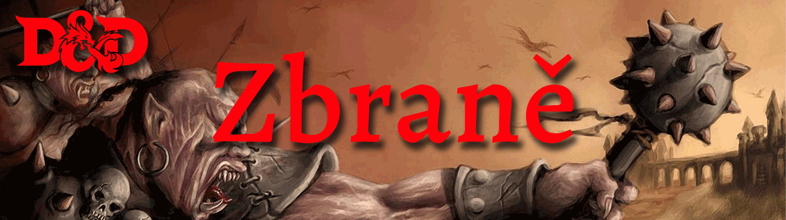
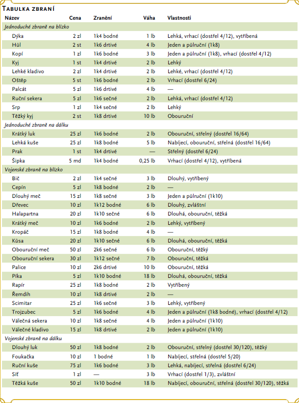

# Zbraně
Vaše třída uděluje dovednosti/zdatnosti v určitých zbraních, což odráží jak zaměření třídy, tak nástroje, které budete s největší pravděpodobností používat. Ať už dáváte přednost dlouhému meči nebo dlouhému luku , vaše zbraň a vaše schopnost ji efektivně ovládat může znamenat rozdíl mezi životem a smrtí při dobrodružství.

## Obsah
1. [Výcvik se zbraní](#výcvik se zbraní)
2. [Vlastnost zbraní](#vlastnosti zbraní)
    1. [Munice](#munice)
    2. [Finesa/vytříbené](#vytříbené)
    3. [Těžké](#těžké)
    4. [Lehké](#lehké)
    5. [Nabíjecí](#nabíjecí)
    6. [Dosah/rozsah](#dosah/rozsah)
    7. [Dlouhé](#dlouhé)
    8. [Speciální](#speciální)
    9. [Vrhací](#vrhací)
    10. [Dvouruční](#dvouruční)
    11. [Univerzální](#univerzální)
    12. [Improvizované zbraně](#improvizované)
3. [Postříbřené zbraně](#postříbřené zbraně)
4. [Speciální zbraně](#speciální zbraně)
5. [Tabulka D&D zbraní](#tabulka)

## Výcvik se zbraní 
Vaše rasa, třída a výkony vám mohou poskytnout dovednosti s určitými zbraněmi nebo kategoriemi zbraní. Tyto dvě kategorie jsou jednoduché a bojové. Většina lidí umí ovládat jednoduché zbraně. Tyto zbraně zahrnují palice, palcáty a další zbraně, které se často nacházejí v rukou prostých lidí. Bojové zbraně, včetně mečů, seker a tyčových zbraní, vyžadují pro efektivní použití specializovanější výcvik. Většina válečníků používá bojové zbraně, protože tyto zbraně nejlépe využívají jejich styl boje a výcvik.

Znalosti se zbraní vám umožňují přidat bonus za vaši odbornost/zdatnost k hodu na útok za jakýkoli útok, který s touto zbraní provedete. Pokud provedete hod na útok pomocí zbraně, se kterou nemáte dostatečné znalosti, nepřipočítáváte k hodu na útok svůj bonus za odbornost.

## Vlastnosti zbraní 
Mnoho zbraní má speciální vlastnosti související s jejich použitím, jak je uvedeno v tabulce zbraní.

### Munice 
Zbraň, která má vlastnost munice, můžete použít k útoku na dálku, pouze pokud máte munici na střelbu ze zbraně. Při každém útoku se zbraní utratíte jeden kus munice. Součástí útoku je tasení munice z toulce, pouzdra nebo jiného kontejneru (k nabití jednoruční zbraně potřebujete volnou ruku). **Na konci bitvy můžete získat zpět polovinu své spotřebované munice tím, že minutu věnujete prohledání bojiště.** Pokud k útoku na blízko použijete zbraň, která má vlastnosti munice, zacházíte se zbraní jako s improvizovanou zbraní *(viz „ Improvizované zbraně “ dále v této části)*. Prak musí být nabitý, aby způsobil poškození při tomto použití.

### Finesa/vytříbené 
Když útočíte vytříbenou zbraní, použijete svůj výběr modifikátoru **Síla nebo Obratnost** k hodům na útok a poškození. Pro oba hody musíte použít stejný modifikátor.

### Těžké 
Malá stvoření mají nevýhodu při hodech na útok těžkými zbraněmi. Vzhledem k velikosti a velikosti těžké zbraně je příliš velká na to, aby ji malý tvor mohl efektivně použít.

### Lehké 
Lehká zbraň je malá a snadno se s ní manipuluje, takže je ideální pro použití při boji se dvěma zbraněmi.

### Nabíjecí 
Vzhledem k času potřebnému k nabití této zbraně z ní můžete vystřelit pouze jeden kus munice, když **k vypálení použijete akci, bonusovou akci nebo reakci,** bez ohledu na počet útoků, které můžete normálně provést.

## Dosah/rozsah 
Zbraň, kterou lze použít k útoku na dálku, má v závorce za municí nebo hozenou vlastností dostřel. Rozsah uvádí dvě čísla. První je normální dosah zbraně ve stopách a druhý udává dlouhý dosah zbraně. Když útočíte na cíl **mimo normální dostřel, máte nevýhodu v hodu na útok**. Nemůžete zaútočit na cíl mimo dosah zbraně.

### Dlouhé 
Tato zbraň **přidává 5 stop k vašemu dosahu,** když s ní útočíte, stejně jako při určování vašeho dosahu pro příležitostné útoky s ní.

### Speciální 
Zbraň se speciální vlastností má neobvyklá pravidla pro její použití, která jsou vysvětlena v popisu zbraně *(viz „ Speciální zbraně “ dále v této části).*

### Vrhací 
Pokud má zbraň vlastnost vrhací, můžete ji **hodit a provést útok na dálku.** Pokud je zbraní zbraň na blízko, použijete pro tento hod na útok a hod na poškození stejný modifikátor schopností, jaký byste použili pro útok na blízko se zbraní. *Pokud například hodíte ruční sekerou, použijete svou sílu, ale pokud hodíte dýku, můžete použít buď svou sílu, nebo svou obratnost, protože dýka má vlastnost vytříbená.*

### Dvouruční 
Tato zbraň vyžaduje dvě ruce, když s ní útočíte.

### Univerzální 
Tato zbraň může být použita jednou nebo dvěma rukama. U vlastnosti se objeví hodnota poškození v závorkách – poškození, když je zbraň použita dvěma rukama k útoku na blízko.

### Improvizované zbraně 
Někdy postavy nemají své zbraně a musí útočit čímkoli, co je po ruce. Improvizovaná zbraň zahrnuje jakýkoli předmět, který můžete ovládat jednou nebo dvěma rukama, jako je rozbité sklo, noha stolu, pánev, kolo vozu nebo mrtvý goblin.

Improvizovaná zbraň je často podobná skutečné zbrani a lze s ní tak zacházet. Například noha stolu je podobná kyji. Na základě volby DM může postava zdatná se zbraní použít podobný předmět, jako by to byla tato zbraň, a využít svůj bonus za odbornost.

Předmět, který se nijak nepodobá zbrani, způsobí poškození 1k4 (DM přiřadí typ poškození vhodný pro daný objekt). Pokud postava použije zbraň na dálku k útoku na blízko nebo hodí zbraň na blízko, která nemá vrženou vlastnost, způsobí také poškození 1k4. Improvizovaná vržená zbraň má normální dostřel 20 stop a dlouhý dosah 60 stop.

## Postříbřené zbraně 
Některá monstra, která mají **imunitu nebo odolnost vůči nemagickým zbraním,** jsou náchylná ke stříbrným zbraním, takže obezřetní dobrodruzi investují extra minci, aby své zbraně pokryli stříbrem. **Za 100 gp můžete vystříbřit jednu zbraň nebo deset kusů munice.** Tyto náklady představují nejen cenu stříbra, ale také čas a odborné znalosti potřebné k přidání stříbra do zbraně, aniž by byla méně účinná.

## Speciální zbraně 
Zde jsou popsány zbraně se speciálními pravidly.

**Kopí**: Máte nevýhodu, když používáte kopí k útoku na cíl do 5 stop od vás. Také kopí vyžaduje dvě ruce k ovládání, když nejste v sedle.

**Síť**: Velká nebo menší bytost zasažená sítí je omezena dokud nebude osvobozena. Síť nemá žádný vliv na tvory, které jsou beztvaré, nebo na tvory, které jsou obrovské nebo větší. Bytost může použít svou **akci ke kontrole síly OČ 10 a osvobodit sebe** nebo jinou bytost na dosah při úspěchu. Způsobení **5 sečného zranění do sítě (OČ 10) také osvobodí tvora**, aniž by mu ublížil, ukončí efekt a zničí síť. Když použijete akci, bonusovou akci nebo reakci na útok sítí, můžete provést pouze jeden útok bez ohledu na počet útoků, které můžete normálně provést.

*Tabulka zbraní ukazuje nejběžnější zbraně používané ve fantasy herních světech, jejich cenu a váhu, poškození, které způsobí, když zasáhnou, a jakékoli speciální vlastnosti, které mají. Každá zbraň je klasifikována jako zbraň na blízko nebo na dálku. Zbraň na blízko se používá k útoku na cíl do 5 stop od vás, zatímco zbraň na dálku se používá k útoku na cíl na dálku.*

